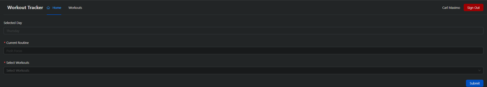

This is a simple website that utilizes Next.js, React, MongoDB, Mongoose, OAUTH, and development on Vercel  

Website is deployed on Vercel which connects to a MongoDB database that stores the workouts and day information

## Screenshots

### Dashboard

### Day Page

### Edit Day

### Add Day

### Workout List

### Edit Workout

### Add Workout

